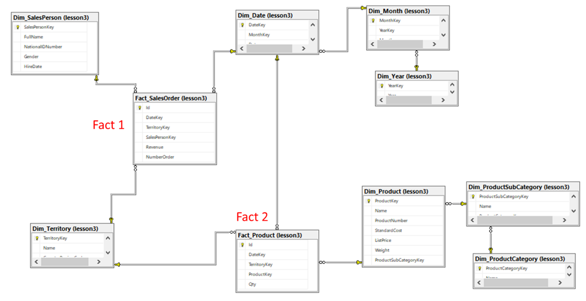
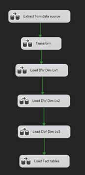

# ETL-AdventureWorks
Thiết kế data warehouse để trả lời các câu hỏi sau:
1.	Báo cáo doanh số theo từng nhân viên
2.	Báo cáo doanh số theo từng khu vực 
3.	Báo cáo số đơn hàng theo nhân viên  
4.	Báo cáo số đơn theo khu vực 
5.	Báo cáo số lượng bán ra theo nhóm sản phẩm 
6.	Báo cáo số lượng bán ra theo sản phẩm và khu vực 

- Bảng dimension: Nhân viên, Khu vực (Sales.Territory), Sản phẩm (Product), Nhóm sản phẩm (ProductCategory & ProductSubcategory), Thời gian (datetime)
- Bảng Fact: Báo cáo 1, 2, 3, 4 do chung chủ đề bảng fact nên gộp thành `Fact_SalesOrder`; Báo cáo 5, 6 gộp thành `Fact_Product`

    

## Workflow
pha Extract sẽ đưa data vào các bảng stagging có tiền tố “Stag_”, pha Transform sẽ biến đổi data từ pha Extract và lưu mới vào các bảng có tiền tố “Stag_Dim”, tới pha Load (L) thì mới chính thức đưa data hoàn chỉnh vào bảng “Dim_” & “Fact_”. Khi Load, ta load các bảng từ ngoài cùng (Lv3) vào dần trong cùng (Lv1)

    

